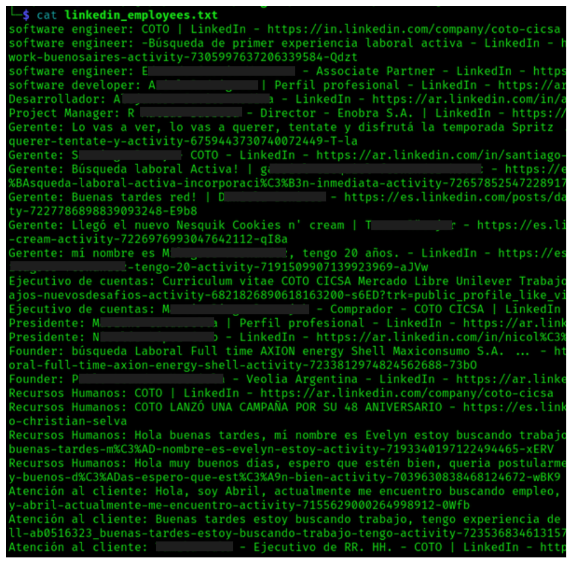
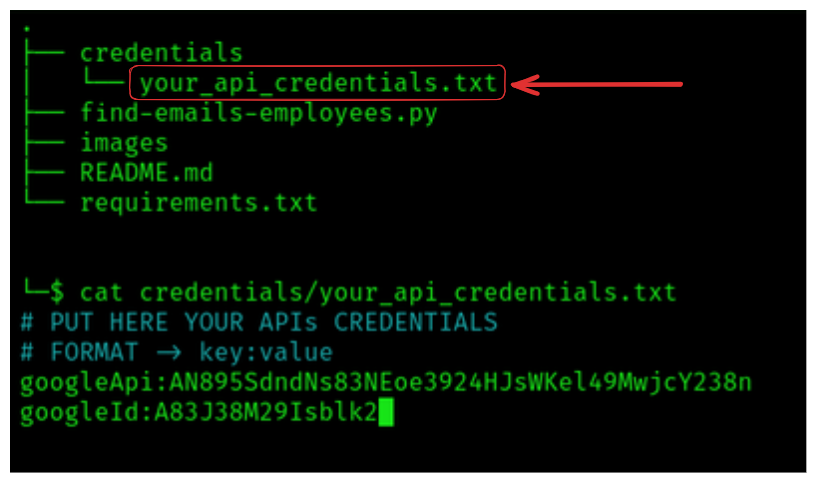

# ✉️ OSINT Linkedin 

Python script to search for empleyees on Linkedin for a company using a domain.
#### **Use:** 
```bash
python3 ./find-linkedin-employees.py
```
#### **Example:** 
```bash
python3 ./find-linkedin-employees.py telefonica.com
```
---
## 📄 Results

All results are obtained from public sources



---
## 🚀 Getting Started

### 1) Install libraries:

```bash
pip3 install -r requirements.txt
```

---

### 2) Get your API and Search Engine ID (FREE!!)

The script perfoms searches using the Google Custom Search API. You must obtain your Google API Key and the Search Engine ID (FREE!!) in order to run the script.

Here I help you how to do it: [https://www.youtube.com/watch?v=4YhxXRPKI0c](https://www.youtube.com/watch?v=4YhxXRPKI0c) (Tutorial)

---

### 3) Set API Key


---
## 🧰 Requirements
---
#### Pre-requisites

Make sure you have installed Python3 and pip

```bash
sudo apt install python3 -y
sudo apt install python3-pip -y
```

---
## 📚 Libraries
```bash
# PYTHON MODULES
requests
re
time
random
signal
sys
os
pwntools
```

---
## 📡 Social Network

Linkedin: [linkedin](https://www.linkedin.com/in/david-padron-9a74aa323/)
